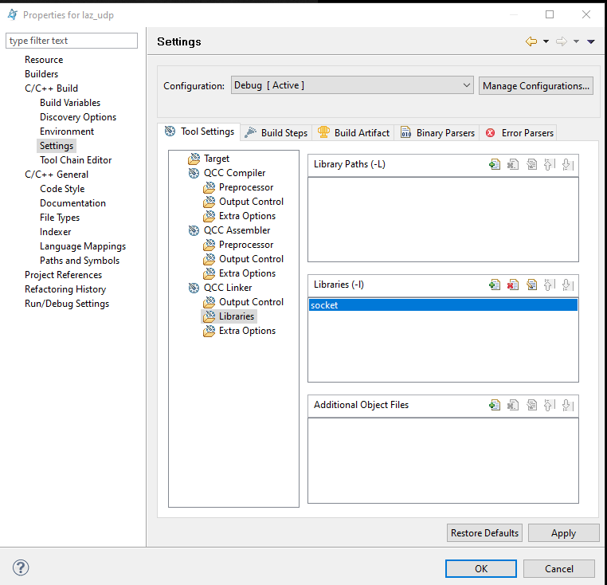

# UDP_QNX_module

Модуль для работы с UDP в ОС QNX. Основан на том, что дал Д.В, Лазиков. 

В папке src - код для проекта под QNX Momentisc. В папке Python - код для проверки приема и отправки сообщений.
В моментикс необходимо создать проект типа C++ project  с компилятором QCC. 
Необходимо запускать компляцию с ключом l socket. Для этого:
- свойства проекта -> с/с++ build -> settings -> (во вкладке tool setting выбрать пункт Libraries) в соседнй вкладке в этом же окне нажать на иконку "листочек плюс" -> ввести socket.
